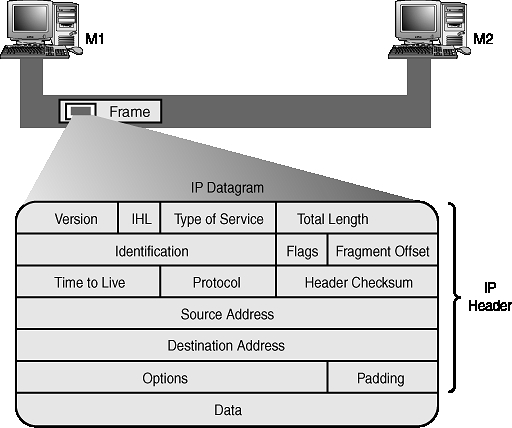

IP
==

Datagrama IP
------------

Ver informacion sobre IP en los slides.

ARP (addres resolution protocol)
================================

Como alcanza un host a otro fisicamente?

Como se entera la red que yo tengo tal o cual direccion?

Debemos encontrar una direccion fisica en funcion de una funcion logica. `Pa = f(La)`

Una solucion seria generar una tabla estatica con pares de direcciones.

